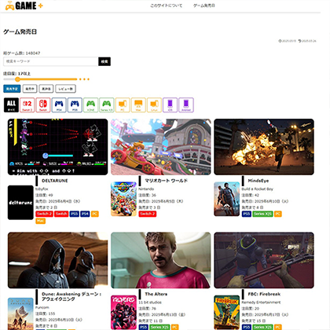

# 🧑‍💻 Takemura

**AI・3D・Python・Web 開発** を軸に活動するフリーランスエンジニアです。

---

## 🔗 ポートフォリオ・リンク集

- GitHub: [github.com/take-works-tech](https://github.com/take-works-tech)
- YouTube: [youtube.com/channel/UCwLIgx3f8fYu5EdJJEMhh7A](https://www.youtube.com/channel/UCwLIgx3f8fYu5EdJJEMhh7A)
- X: [@tzero3\_](https://twitter.com/tzero3_)

---

## 🛠 技術スタック

<table width="100%" style="table-layout: fixed;">
  <colgroup>
    <col style="width:50%;">
    <col style="width:50%;">
  </colgroup>
  <tr>
    <td valign="top">

### 🤖 AI・機械学習

| 技術分野           | スキル                                     |
| ------------------ | ------------------------------------------ |
| **フレームワーク** | TensorFlow, PyTorch, scikit-learn          |
| **生成 AI**        | Stable Diffusion, HuggingFace Transformers |
| **データ処理**     | Python, NumPy, Pandas                      |
| **可視化**         | Matplotlib                                 |

- **経験**:
  - 学習用合成データ生成（3D）
  - データ前処理・パイプライン自動化
  - 画像認識モデルの学習・チューニング
  - 機械学習を用いたデータ分析・予測

### 🌐 Web 開発

| 技術分野               | スキル                            |
| ---------------------- | --------------------------------- |
| **フロントエンド**     | TypeScript, JavaScript, HTML, CSS |
| **フレームワーク**     | React, Next.js                    |
| **バックエンド**       | Python, Django, PHP               |
| **API 開発**           | REST API 設計・実装               |
| **決済システム**       | Stripe 統合                       |
| **認証・セキュリティ** | 認証システム構築, API 管理        |

</td>
<td valign="top">

### 🎨 3D 技術

| 技術分野            | スキル                                                                  |
| ------------------- | ----------------------------------------------------------------------- |
| **プログラミング**  | C++, Python, Verse (Epic Games 開発言語)                                |
| **ゲームエンジン**  | Unreal Engine 5, UEFN, Unity                                            |
| **3D ソフトウェア** | Blender, Substance 3D Painter, ZBrush                                   |
| **3D 技術**         | 3D モデリング全般（テクスチャペインティング、リギング、アニメーション） |
| **特殊技術**        | G-code (3D プリンター制御)                                              |

### 🔩 工学・解析

| 技術分野           | スキル                       |
| ------------------ | ---------------------------- |
| **CAE 解析**       | ANSYS（構造解析）            |
| **CAD**            | Autodesk Inventor, Fusion360 |
| **プログラミング** | Python（解析自動化、可視化） |
| **可視化**         | Matplotlib                   |
| **学術背景**       | 機械工学修士                 |

### 📊 その他スキル

| 技術分野   | スキル            |
| ---------- | ----------------- |
| **Adobe**  | Photoshop         |
| **Office** | Excel, PowerPoint |

</td>
  </tr>
</table>

---

## 🚀 ポートフォリオの主なプロジェクト

### 🧠 ARC Prize 2025 ハイブリッドソルバー（Kaggle コンペ参加用）

**技術スタック**: Python, PyTorch, DSL（独自設計）, プログラム合成

- Kaggle「ARC Prize 2025」向けのハイブリッド推論パイプライン
- 独自設計した DSL ランタイム／インタプリタを開発し、ルールベース推論を強化
- ルールベース DSL とニューラルプログラム合成を組み合わせた問題解決アプローチ
- ARC タスク向けのデータセット生成器・品質検証フローを構築し、再現性ある学習データを確保
- データ生成・検証・推論を統合した CLI とログ管理ワークフローを構築

📄 プロジェクト → [arc-agi2-arc2025](https://github.com/take-works-tech/arc-agi2-arc2025)

---

### 🌾 エッジ AI × 画像認識（IoT 向け）

**技術スタック**: Python, YOLOv8, ONNX, TensorRT, Jetson Nano, Raspberry Pi

- スマート農業向け果樹検出 AI システム
- ドローン／カメラからの映像をリアルタイムで解析
- 軽量モデル（YOLOv8-Nano）の学習・量子化・最適化
- エッジデバイス向けフォーマット変換・デプロイ

📄 プロジェクト → [Smart Agriculture Edge AI](https://github.com/take-works-tech/smart-agri-edge-ai)

---

### 🎭 3D フェイス合成データセット生成パイプライン

**技術スタック**: Python, Blender

- 機械学習向け多様な 3D フェイス画像自動生成システム
- 肌色、しわ、メイク、髪色などのバリエーション展開
- 属性ラベル付きデータセットの自動構築

📄 プロジェクト → [blender-face-dataset-generator](https://github.com/take-works-tech/3d-face-dataset-generator)

---

### 🤖 AI 生成パイプライン

**技術スタック**: Python

- ゲーム用効果音パックの自動生成スクリプト
- 音声生成＋ビデオプレビューの自動生成機能

📄 プロジェクト → [soundpack-generator](https://github.com/take-works-tech/soundpack-generator)

🎞️ Video ↓

---

### 📝 WordPress 固定ページテンプレート（ゲーム情報）

**技術スタック**: PHP

- 独自 DB や IGDB API からゲーム情報を取得し一覧表示
- API 連携による自動更新機構
- WordPress 用カスタムテンプレート

📄 プロジェクト → [Cocoon Child – Game Detail](https://github.com/take-works-tech/cocoon-child-game-list)

---

### 🌐 SaaS Web アプリケーション

| 領域           | フレームワーク                                   | 言語       |
| -------------- | ------------------------------------------------ | ---------- |
| フロントエンド | Node.js, Vite, React, Shadcn UI または Bootstrap | TypeScript |
| バックエンド   | Django REST Framework, PostgreSQL                | Python     |

- AI 音声生成サービスの完全な SaaS アプリケーション
- 認証システム・決済処理・API 管理・使用制限機能を実装
- エンドツーエンドの商用サービス構築

📄 プロジェクト → [AudioGen SaaS](https://github.com/take-works-tech/audiogen-saas-app)

---

### 🎮 UEFN 個人ゲーム制作

**技術スタック**: Blender, Substance 3D Painter, Verse, UEFN

- 3D モデリング、アニメーション、プログラミングを一貫して担当
- Fortnite 向けのインタラクティブ体験を開発中

🎞️ Video ↓

---

### 🖼️ 画像認識モデル + 画像処理（C++, Python）

**技術スタック**: C++17, Python, pybind11, Eigen3, MediaPipe

- フェイシャルランドマークから UV マップを生成する独自ライブラリ
- C++と Python バインディングによる高性能処理
- MediaPipe Face Mesh + アフィン変換による 3D テクスチャ整列

📄 プロジェクト →

Python: [face_uvmap_py](https://github.com/take-works-tech/face_uvmap)

C++: [face_uvmap_cpp](https://github.com/take-works-tech/face_uvmap_cpp)

---

### 🔩 有限要素解析と形状最適化【非公開】

**技術スタック**: Python, ANSYS, Matplotlib

- 大学、大学院で研究。論文執筆。
- Python による解析の自動化と Matplotlib, Excel による可視化。

---

## 🎯 専門分野

### 得意領域

- **AI 開発**: 画像認識、生成 AI
- **Web 開発**: フルスタック開発、SaaS 構築
- **3D 技術**: モデリング全般
- **工学**: 機械工学
- **Python 開発**: 可視化、データ処理、自動化

---

## 📈 技術的強み

### 🤝 多領域シナジー

Web・3D・AI・工学を横断する知識

### 🌐 フルスタック Web 開発力

フロントエンド（React/Next.js）からバックエンド（Python/Django）、AI 統合まで一貫した開発が可能

### エッジ＆クラウド統合開発力

エッジデバイス（Jetson Nano／Raspberry Pi）からクラウドベースの SaaS Web アプリまで、要件定義〜設計・実装・デプロイまで一貫して推進

### 💼 商用アプリケーション構築

認証、決済、API 管理を含む実用的な SaaS アプリケーション開発経験

### 🎨 3D・クリエイティブ技術

工学的バックグラウンドを活かした高度な 3D 処理と可視化技術

### ⚡ 高性能コンピューティング

C++による最適化と Python バインディングを組み合わせた効率的なソリューション開発

---

## 🛠️ 開発環境・ツール

**バージョン管理**: Git/GitHub
**AI・Web 開発**: VSCode, Cursor, Visual Studio
**3D 制作**: Blender, ZBrush, Substance 3D Painter
**ゲーム開発**: Unreal Engine 5, UEFN

---

## 📧 お問い合わせ

プロジェクトのご相談やコラボレーションをご希望の方は、X 経由でお気軽にご連絡ください。

- X: [@tzero3\_](https://twitter.com/tzero3_)

**専門領域**: 3D 技術 | AI 開発 | Web 開発 | Python 自動化
