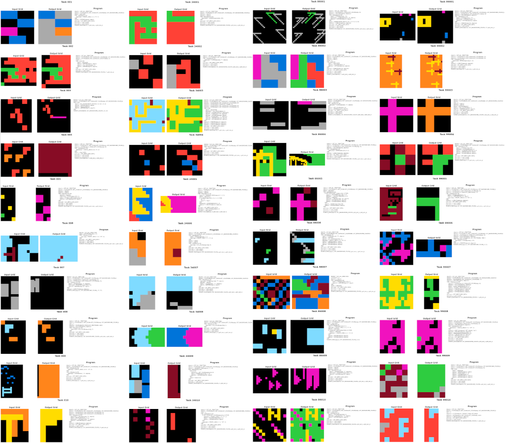
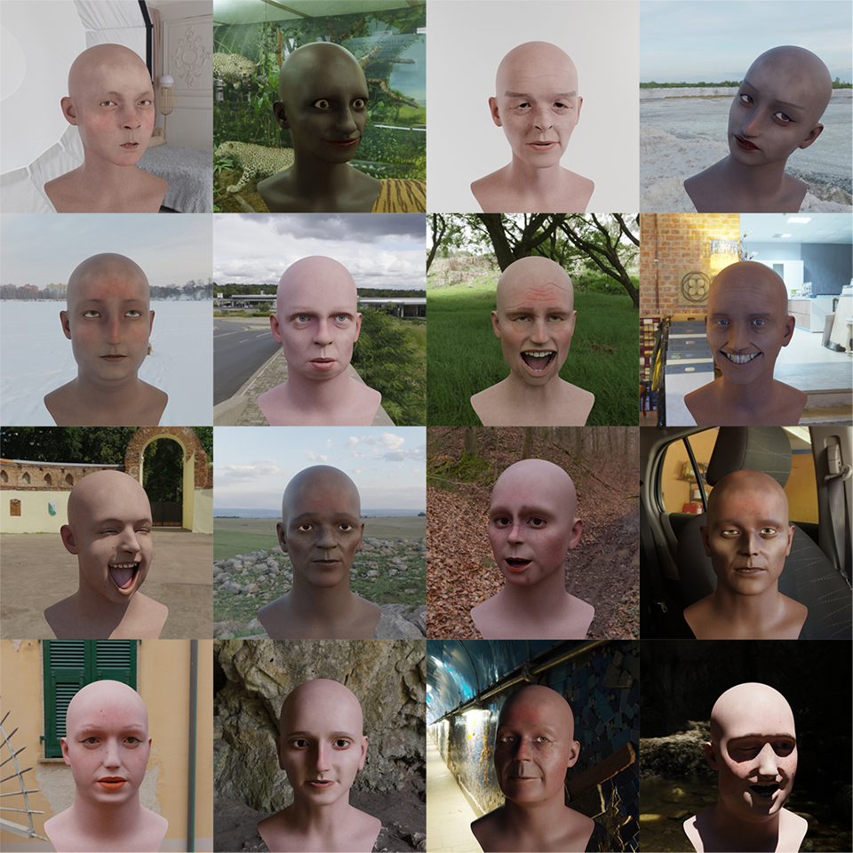
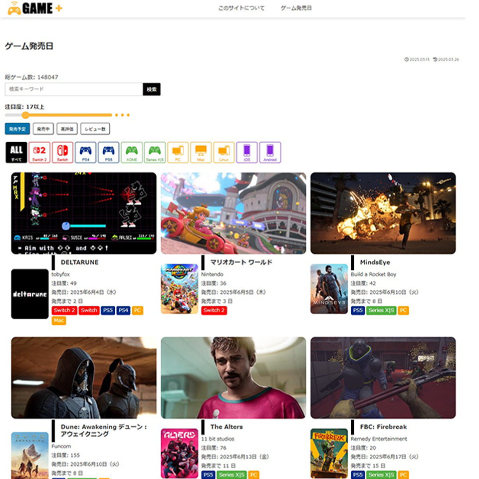

# 🧑‍💻 Takemura

**3D, Python, and Web Development** after completing a Master's degree in Mechanical Engineering.

📄 日本語版はこちら → [README.ja.md](README.ja.md)

---

## 🔗 Portfolio & Links

- GitHub: [github.com/take-works-tech](https://github.com/take-works-tech)
- YouTube: [youtube.com/channel/UCwLIgx3f8fYu5EdJJEMhh7A](https://www.youtube.com/channel/UCwLIgx3f8fYu5EdJJEMhh7A)
- X: [@tzero3\_](https://twitter.com/tzero3_)

---

## 🛠 Technical Stack

<table width="100%" style="table-layout: fixed;">
  <colgroup>
    <col style="width:50%;">
    <col style="width:50%;">
  </colgroup>
  <tr>
    <td valign="top">

### 🤖 AI & Machine Learning

| Domain              | Skills                                     |
| ------------------- | ------------------------------------------ |
| **Frameworks**      | TensorFlow, PyTorch, scikit-learn          |
| **Generative AI**   | Stable Diffusion, HuggingFace Transformers |
| **Data Processing** | Python, NumPy, Pandas                      |
| **Visualization**   | Matplotlib                                 |

- **Key Achievements**:
  - Synthetic data generation for training (3D)
  - Data preprocessing & pipeline automation
  - Image recognition model training & fine-tuning
  - Machine learning-based data analysis & prediction

### 🌐 Web Development

| Domain                        | Skills                                 |
| ----------------------------- | -------------------------------------- |
| **Frontend**                  | TypeScript, JavaScript, HTML, CSS      |
| **Frameworks**                | React, Next.js                         |
| **Backend**                   | Python, Django, PHP                    |
| **API Development**           | REST API design & implementation       |
| **Payment Systems**           | Stripe integration                     |
| **Authentication & Security** | Authentication systems, API management |

  </td>
    <td valign="top">

### 🎨 3D Technology

| Domain               | Skills                                                           |
| -------------------- | ---------------------------------------------------------------- |
| **Programming**      | C++, Python, Verse (Epic Games development language)             |
| **Game Engines**     | Unreal Engine 5, UEFN, Unity                                     |
| **3D Software**      | Blender, Substance 3D Painter, ZBrush                            |
| **3D Techniques**    | Comprehensive 3D modeling (texture painting, rigging, animation) |
| **Specialized Tech** | G-code (3D printer control)                                      |

### 🔩 Engineering & Analysis

| Domain                  | Skills                                      |
| ----------------------- | ------------------------------------------- |
| **CAE Analysis**        | ANSYS (structural analysis)                 |
| **CAD**                 | Autodesk Inventor, Fusion360                |
| **Programming**         | Python (analysis automation, visualization) |
| **Visualization**       | Matplotlib                                  |
| **Academic Background** | Master's in Mechanical Engineering          |

### 📊 Additional Skills

| Domain     | Skills            |
| ---------- | ----------------- |
| **Adobe**  | Photoshop         |
| **Office** | Excel, PowerPoint |

  </td>
  </tr>
</table>

---

## 🚀 Featured Portfolio Projects

### 🧠 ARC Prize 2025 Hybrid Solver (for Kaggle Competition)

**Tech Stack**: Python, PyTorch, custom DSL, program synthesis

- Hybrid inference pipeline tailored for Kaggle's “ARC Prize 2025”
- Designed and implemented an in-house DSL runtime/interpreter to power rule-based reasoning
- Combines rule-based DSL execution with neural program synthesis for task solving
- Built a dedicated dataset generator and validation flow to secure reproducible ARC training data
- Unified CLI workflow covering data generation, validation, inference, and log management

📄 Project → [arc-agi2-arc2025](https://github.com/take-works-tech/arc-agi2-arc2025)

---

### 🌾 Edge AI × Image Recognition (IoT)

**Tech Stack**: Python, YOLOv8, ONNX, TensorRT, Jetson Nano, Raspberry Pi

- AI system for smart agriculture fruit detection
- Real-time analysis of drone/camera footage
- Training, quantization & optimization of lightweight models (YOLOv8-Nano)
- Format conversion & deployment for edge devices

📄 Project → [Smart Agriculture Edge AI](https://github.com/take-works-tech/smart-agri-edge-ai)

---

### 🎭 3D Face Synthetic Dataset Generation Pipeline

**Tech Stack**: Python, Blender

- Automated generation system for diverse 3D face images for machine learning
- Variation expansion including skin tone, wrinkles, makeup, hair color
- Automatic construction of attribute-labeled datasets

📄 Project → [blender-face-dataset-generator](https://github.com/take-works-tech/3d-face-dataset-generator)

---

### 🤖 AI Generation Pipeline

**Tech Stack**: Python

- Automated generation script for game sound effect packs
- Audio generation + automatic video preview generation

📄 Project → [soundpack-generator](https://github.com/take-works-tech/soundpack-generator)

🎞️ Video ↓

---

### 📝 WordPress Custom Page Template (Game Info)

**Tech Stack**: PHP

- Game information retrieval and display from custom DB and IGDB API
- Automatic update mechanism via API integration
- Custom template for WordPress

📄 Project → [Cocoon Child – Game Detail](https://github.com/take-works-tech/cocoon-child-game-list)

---

### 🌐 SaaS Web Application

| Layer    | Framework                                    | Language   |
| -------- | -------------------------------------------- | ---------- |
| Frontend | Node.js, Vite, React, Shadcn UI or Bootstrap | TypeScript |
| Backend  | Django REST Framework, PostgreSQL            | Python     |

- Complete SaaS application for AI voice generation services
- Implementation of authentication, payment processing, API management, and usage limits
- End-to-end commercial service development

📄 Project → [AudioGen SaaS](https://github.com/take-works-tech/audiogen-saas-app)

---

### 🎮 UEFN Personal Game Development

**Tech Stack**: Blender, Substance 3D Painter, Verse, UEFN

- Comprehensive responsibility for 3D modeling, animation, and programming
- Interactive experience development for Fortnite (in progress)

🎞️ Video ↓

---

### 🖼️ Image Recognition Model + Image Processing (C++, Python)

**Tech Stack**: C++17, Python, pybind11, Eigen3, MediaPipe

- Custom library for generating UV maps from facial landmarks
- High-performance processing with C++ and Python bindings
- 3D texture alignment using MediaPipe Face Mesh + affine transformation

📄 Projects →

Python: [face_uvmap_py](https://github.com/take-works-tech/face_uvmap)

C++: [face_uvmap_cpp](https://github.com/take-works-tech/face_uvmap_cpp)

---

### 🔩 Finite Element Analysis & Shape Optimization [Private]

**Tech Stack**: Python, ANSYS, Matplotlib

- University and graduate school research with paper publication
- Analysis automation with Python and visualization using Matplotlib & Excel

---

## 🎯 Areas of Expertise

### Core Competencies

- **AI Development**: Image recognition, generative AI
- **Web Development**: Full-stack development, SaaS construction
- **3D Technology**: Comprehensive modeling
- **Engineering**: Mechanical engineering
- **Python Development**: Visualization, data processing, automation

---

## 📈 Technical Strengths

### 🤝 Cross‑Domain Synergy
Broad expertise spanning Web, 3D, AI, and engineering

### 🌐 Full‑Stack Web Development
End‑to‑end implementation from frontend (React/Next.js) to backend (Python/Django) and AI integration

### 🚀 Edge & Cloud Integrated Development
Seamless delivery from edge devices (Jetson Nano/Raspberry Pi) to cloud‑based SaaS applications—requirements gathering, design, implementation, and deployment

### 💼 Commercial Application Engineering
Hands‑on experience building production‑grade SaaS applications with authentication, payment processing, and API management

### 🎨 3D & Creative Technologies
Advanced 3D processing and visualization techniques leveraged on an engineering background

### ⚡ High‑Performance Computing
Efficient solutions combining C++ optimization with Python bindings

---

## 🛠️ Development Environment & Tools

**Version Control**: Git/GitHub
**AI & Web Development**: VSCode, Cursor, Visual Studio
**3D Production**: Blender, ZBrush, Substance 3D Painter
**Game Development**: Unreal Engine 5, UEFN

---

## 📧 Contact

For project consultations or collaboration opportunities, please feel free to contact me via X.

- X: [@tzero3\_](https://twitter.com/tzero3_)

**Specialization Areas**: 3D Technology | AI Development | Web Development | Python Automation
